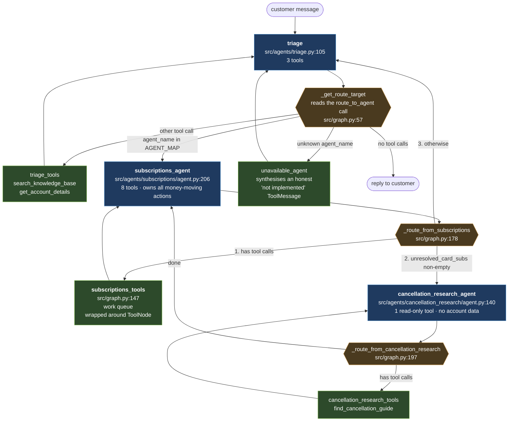
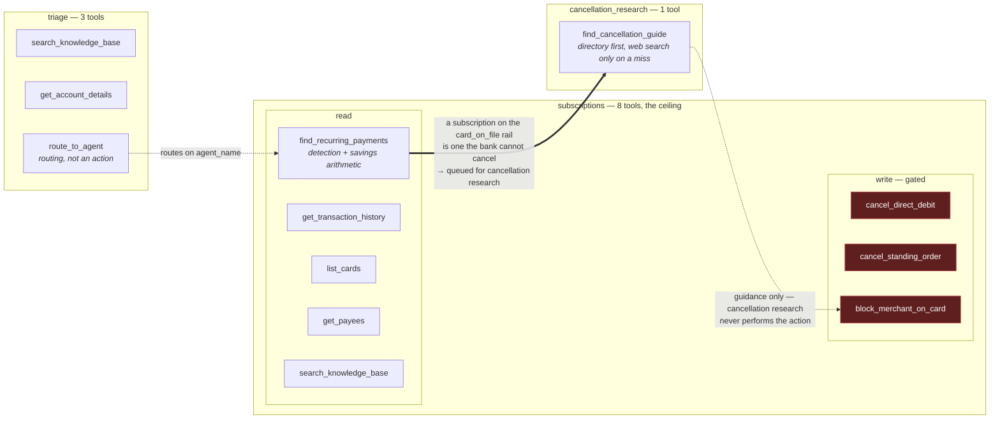
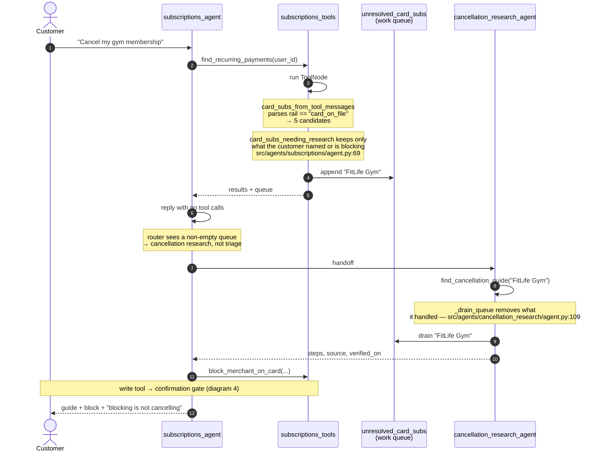
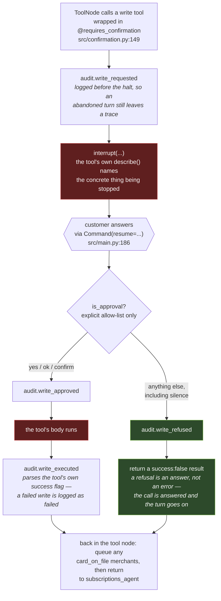
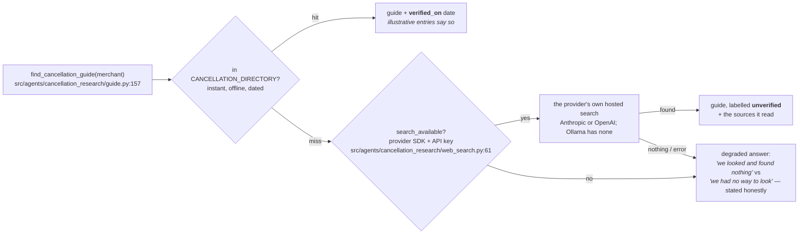

# Architecture — how the agents interact and how they use tools

Diagrams for the design decisions argued in [README.md](README.md#design). Nothing here is
new policy; it is the same wiring drawn out. Every node and edge below exists in
`src/graph.py:212`.

## Start here — the whole thing in plain English

There are **three agents**. Think of them as three people at a bank.

| Agent | Think of them as | Can do |
|---|---|---|
| `triage` | The receptionist | Look things up. Decide who takes this. Changes nothing. |
| `subscriptions` | The money specialist | See the customer's payments. Stop them. |
| `cancellation_research` | The contract expert | Explain how to quit Netflix or a gym. No account access, no money tools. |

The **graph** is just the corridor between them — boxes are the agents, arrows are who is
allowed to walk to whom.

**One rule drives all of it.** After any agent speaks, the code asks a single question: *did
it call a tool?*

- **Yes** → not finished. Run the tool, give it the answer, let it carry on.
- **No** → finished. Hand control on.

Every arrow in the diagrams below is that one question, asked in three places.

**Why cancellation research ever gets involved.** Money leaves an account by one of three routes: direct
debit, standing order, or a card. The bank can stop the first two itself. It **cannot** stop a
card one — only the merchant can. So when a card subscription is found, its name goes on a
list, and the router checks that list: *not empty → cancellation research; empty → go home.* No model
decides this; it is an `if` statement reading a label.

**Why nothing is cancelled by accident.** Three tools move money. Before any of them runs,
the graph freezes and asks the customer outright: *"Cancel DD-4472 — yes or no?"* Only a clear
yes counts; a typo, a blank line or walking away all mean no. That check lives in the code
rather than in the agent's instructions, because instructions can be skipped and code cannot.

The rest of this file is the same story with the identifiers filled in.

## 1. Graph topology

Solid arrows are graph edges. Diamonds are the routing functions — plain Python reading
state, never a model deciding where to go next.

Two things the picture makes explicit:

- **Triage cannot reach cancellation research.** `AVAILABLE_AGENTS` (`src/graph.py:38`) lists only
  `subscriptions`, so cancellation research has no inbound edge from triage. It is reachable solely by the
  rail-driven handoff.
- **Cancellation research cannot reach triage.** It holds no account data, so it cannot close out a turn;
  it always returns control to the specialist.

## 2. Tool ownership

The boundary is *what the bank knows* vs *what the merchant knows*. Nothing is bound to two
agents except `search_knowledge_base`, which is thinkmoney's own policy and belongs to both.

`get_standing_orders` is deliberately unbound: `find_recurring_payments` already reads the
standing-order fixture, so binding it would spend one of the eight slots on a duplicate
lookup.

## 3. The deterministic handoff

The delegation trigger is read off the turn — **a rail label in tool output, scoped to the
merchants the customer's own words name or a block is being placed on** — never a model
judgement. This is what makes the demo repeatable across providers.

The scoping is the second half of that sentence, and it was missing at first. The rail label
alone was the whole trigger, which made the handoff fire on the shape of the report rather
than on the request: any customer holding a card-billed subscription sent *every* one of
them to cancellation research. Asked "what subscriptions am I paying for?", the agent
answered with the list and then, unprompted, the cancellation steps for a gym — five
directory lookups to produce advice nobody had asked for. Determinism was never the problem;
the trigger was reading the data instead of the request. `card_subs_needing_research`
(`src/agents/subscriptions/agent.py:69`) narrows the candidates, and both halves still come
from parsing, so the handoff remains model-free.

The drain is load-bearing. If cancellation research returns the queue untouched, the router sends control
straight back to cancellation research and the turn dies at LangGraph's recursion limit of 25 —
`tests/test_delegation.py:1` monkeypatches the drain away to prove the loop is real.

## 4. The confirmation gate

Gated **structurally, on the tool itself** — not by asking nicely in the system prompt. The
halt happens *before* the tool's body runs, so a resume cannot re-run a side effect. This is
the placement LangGraph documents, and it makes a refusal self-answering: the tool returns an
ordinary result either way, so no `tool_call_id` is ever left unanswered.

The failure mode of a garbled answer is *nothing happened*, never *the money moved*. Called
with no graph behind it there is nobody to ask, so the same refusal is returned rather than
the write going ahead unauthorised.

### The model says what, the tool decides how

A write tool that takes `mandate_id` is asking the model to do a lookup the data already
answers. `src/tools/rails.py:1` owns merchant → (rail, reference) as one function reading the
same fixtures detection reads, and the three write tools take a **merchant** and resolve the
reference themselves. `cancel_direct_debit(merchant="Google One")` cannot reach `DD-4472`,
because nothing in the call path lets a Google One request produce a mandate — Google One is
card-billed, and the tool refuses with the remedy that would work:

> Google One is billed to a card (CARD-8834), not a direct debit. There is no mandate to
> cancel — the charge can only be blocked. Use block_merchant_on_card instead.

A reference may still be passed, but it is treated as a *claim to check* rather than as the
instruction: supply one that belongs to another merchant and the write refuses. Ambiguity
refuses too — "Netflix" resolves to the direct debit by exact match, but a name matching two
subscriptions is handed back to be asked about rather than guessed at.

This is the same move as the confirmation gate. The gate stops a write happening without a
human; this stops a write happening to the wrong thing. Both work by removing the decision
from the prompt rather than instructing the model harder — the prompt already said "match the
remedy to the rail", and that is exactly what was ignored.

That leaves one decision with the model: **which merchant**. `resolve_rail` makes the
mechanism and the reference correct for whatever name it is given, so a model naming the
wrong subscription still gets a correct cancellation of the wrong thing.
`_writes_contradicting_the_request` (`src/graph.py:174`) checks the name against what the
customer actually said — in the tool node, because it is the only place where the
conversation and the pending tool calls are both in scope; tools receive arguments, never
message history.

The rule is that **a write must be bound to a subscription the customer identified**:

| Customer said | Model passed | Verdict |
|---|---|---|
| "cancel Google One" | `Google One` | proceeds to the gate |
| "cancel Google One" | `Spotify` | refused — contradiction |
| "cancel it" | `Spotify` | refused — nothing binds it; ask |
| "cancel my gym membership" | `FitLife Gym` | refused — nothing binds it; ask |
| "cancel Netflix" | either Netflix | proceeds — genuinely ambiguous, both named |

The first version of this check only caught contradiction and let an unbound write through,
which meant it failed *open*: "cancel it" let the model pick freely and a wrong pick went
through silently. That is the wrong default for a bank. An unbound write is now refused with
the list of subscriptions that tool could act on, and the agent asks the customer to name
one — so the binding comes from a list the code generated and a person who knows the answer,
rather than from inference.

Which subscription someone means by "it" is not in the data; it is in their head. So this is
the one place the design stops trying to derive an answer and asks instead — the same move as
the gym-usage question, for the same reason. The cost is an extra exchange when the customer
was vague; the alternative is acting on an assumption about their money.

Matching a name is still fuzzy, but it can now only ever *unlock* a write, never license a
guess: no match means ask. Failing that way round is what makes the fuzziness affordable — a
typo costs a question, not a cancellation. Typed "cancel netfix", the customer gets the list
rather than a guess at which Netflix they meant.

**The list has to be answerable.** Asking was the first half; the first version asked for a
name and a customer replying "2" named nothing, so the write was refused for having no
referent and the identical question came back. Cancelling Netflix was unreachable. The offer
is now numbered, and `offered_subscriptions` holds that exact list in state, so
`_choice_from_offer` (`src/graph.py:179`) resolves the answer against the question that
produced it. Only a bare number counts: "£2.99" and "cancel 2 of these" select nothing,
because reading a choice into them would act on a subscription nobody pointed at. The list is
cleared once a choice is made, so a later "2" cannot select from a question long since
answered.

The numbering lives in code and the agent is told to relay it verbatim, but it is the agent
that types it to the customer — so a model that renumbers could still misalign the answer.
The gate is what covers that: it names the resolved merchant and amount before anything runs.

**The offer is scoped to the conversation.** Rail alone was too broad: a customer asking
about Netflix was shown every direct debit on the account, so their domain renewal appeared
in a list about streaming. `options_for` (`src/tools/rails.py:176`) narrows it using the
merchant the model proposed — not as authority, that name is the thing being checked, but as
a reliable hint about what is being discussed, which is safe precisely because the customer
still makes the choice. It uses every fuzzy match rather than `find_rails`, whose exact-name
short-circuit is right for resolving one subscription and wrong for offering a choice
between two: scoped by "Netflix" the customer needs to see both the direct debit and the
shared standing order, since that *is* the question. A name matching nothing falls back to
the whole rail, because an empty question is worse than a broad one, and a name not on the
list still works — the scope narrows what is proposed, never what is possible.

**Essentials are never offered.** The standing-order list once put the customer's rent
alongside a shared Netflix subscription as things to cancel. Housing, Utilities and Insurance
are excluded — the same categories detection keeps out of the savings figures. They remain
cancellable by name; they are just not proposed.

**The answer is read the way people write it.** Requiring a bare digit meant "cancel 1" — the
customer's actual reply — selected nothing and returned them to the same question. Leading
words are stripped before the number is read, but anything left over still disqualifies it:
"cancel 2 of these", "£2.99" and "1 and 2" select nothing rather than acting on a
subscription nobody pointed at.

One deliberate asymmetry: a card block honours a card the merchant does not currently bill,
because a block is forward-looking and blocking a merchant on a card it has not charged yet
is a real instruction. A mandate is not — it belongs to exactly one merchant, so there the
cross-check is strict.

### What the gate shows

A gate is only as good as what it shows. Each tool supplies its own `describe`, and those
descriptions resolve references back to the merchant and amount they belong to — because an
identifier the customer cannot check makes the halt decorative. Asked to cancel Google One,
which is card-on-file and has no mandate at all, the agent called `cancel_direct_debit` on
`DD-4472`: Namecheap's domain renewal. The gate fired correctly and asked "Cancel the direct
debit DD-4472" — the one string in the exchange that could have exposed the mistake, written
so that it couldn't. The customer approved, and was told Google One had been cancelled. The
descriptions now name the merchant, and the contract caveat sits in the confirmation rather
than in the reply afterwards, because a warning that arrives after the money has stopped is
not a warning. Pinned by `tests/test_confirmation_gate.py::TestDescriptions`.

Carrying the decorator **is** the registration: `CONFIRMED_TOOLS` collects every gated name,
and `tests/test_confirmation_gate.py:1` asserts it matches the tools that move money — so a
write tool added without a gate fails a test rather than shipping a hole.

Because the gate lives here rather than in the prompt, the subscriptions system prompt tells
the model the opposite of what reads as safe: once the customer has asked for a change,
**call the write tool, do not ask again.** Asking in prose merely ends the turn — the
customer's "yes" never reaches the model, and the action they asked for silently never
happens.

That instruction is conditional, and the condition is load-bearing. It was once
unconditional, and a bolded "call the write tool, do not ask first" at the top of the bullet
outranked the qualifier six sentences below it: asked *"what subscriptions am I paying
for?"*, GPT-4o-mini went straight to `cancel_direct_debit(DD-4471)` without answering. The
gate held — nothing executed — but the customer was shown a cancellation they never
requested instead of the list they asked for, and `DD-4471` was the subscription the
duplicate strategy says to *keep*. Two things fed it: the buried precondition, and the
savings report's own imperative mood (`"Cancel SO-102 — …"`) sitting in context next to both
identifiers. The prompt now leads with *a question is not an instruction*, and
`_detect_duplicates` phrases its recommendation as an option and names which reference to
drop and which to keep. Ordering is pinned by
`tests/test_subscriptions_agent.py::TestSystemPrompt`.

Both are mitigations, not guarantees: they steer a model rather than constrain it. The
structural guarantee is still the gate, which is why it exists.

## 5. One tool worth drawing: `find_cancellation_guide`

Directory-first ordering is enforced *inside the tool*, so no prompt slip and no model
preference can reorder it. Cancellation research binds no independent web-search tool.

## Where each piece lives

| Concern | File |
|---|---|
| Graph wiring and routers | `src/graph.py:212` |
| The write gate (decorator + approval parsing) | `src/confirmation.py:149` |
| Work-queue state field | `src/models.py:29` |
| Specialist agent + rail parsing | `src/agents/subscriptions/agent.py:43` |
| Cancellation research agent + queue drain | `src/agents/cancellation_research/agent.py:109` |
| Detection, savings, cancellation tools | `src/agents/subscriptions/detection.py:758` |
| CLI, checkpointer, resume | `src/main.py:204` |
